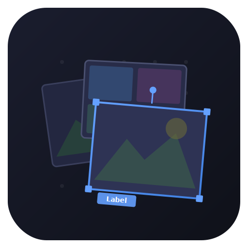

<p align="center">
  
</p>

<h1 align="center">HyprBoard</h1>

<p align="center">Lightweight image reference board for Wayland, built in Rust</p>

## Status


**Beta Release** - A PureRef/BeeRef alternative built with egui + eframe (wgpu/Vulkan backend). Designed for Wayland compositors, especially Hyprland.

## Features

- **Infinite Canvas**: Pan (middle-click), zoom (scroll wheel), grid with snap
- **Image Management**: Load, paste, drag-and-drop images from files, clipboard, or URLs
- **Selection & Manipulation**: Multi-select, resize handles, rotation, z-ordering
- **Image Ops**: Crop, flip H/V, grayscale, opacity
- **Text & Labels**: Standalone text items, image-attached labels
- **Clipboard**: Copy/cut single images or multi-select collages (via `wl-copy`/`wl-paste`)
- **Persistence**: SQLite-based `.hboard` files, autosave, recent files
- **BeeRef Import**: Open `.bee` files directly
- **Export**: Select a canvas region and export to PNG
- **Vim-style Keys**: `h/j/k/l` nudge, `x` delete, `u` undo
- **Wayland DnD**: Full drag-and-drop from file managers and browsers (via patched winit)

## Installation

### Prerequisites

- Rust 1.85+ (2024 edition)
- Wayland compositor
- `wl-copy` / `wl-paste` (from `wl-clipboard`)

### Building from Source

```bash
git clone https://github.com/abjoru/hyprboard
cd hyprboard
cargo build --release
```

The binary will be at `target/release/hyprboard`.

## Usage

```bash
# Run
hyprboard

# With debug logging
RUST_LOG=debug hyprboard
```

### Keyboard Shortcuts

#### General

| Key | Action |
|-----|--------|
| `Ctrl+O` | Open file (.hboard, .bee, or image) |
| `Ctrl+S` | Save |
| `Ctrl+Shift+S` | Save As |
| `Ctrl+Z` | Undo |
| `Ctrl+Shift+Z` | Redo |
| `Ctrl+E` | Export region |
| `Ctrl+T` | Toggle toolbar |
| `Ctrl+G` | Toggle grid |
| `Ctrl+Shift+G` | Toggle snap-to-grid |
| `F` | Fit all items in view |
| `Shift+F` | Fit selected items in view |
| `Escape` | Deselect all / cancel crop |

#### Selection & Items

| Key | Action |
|-----|--------|
| Click | Select item |
| Shift+Click | Multi-select |
| Drag (empty) | Selection rectangle |
| `Delete` / `Backspace` | Delete selected |
| `]` / `[` | Raise / lower z-order |
| Double-click (empty) | Create text item |
| Double-click (text) | Edit text |

#### Vim-style (when items selected)

| Key | Action |
|-----|--------|
| `h/j/k/l` | Nudge left/down/up/right |
| `x` | Delete selected |
| `u` | Undo |

#### Image Operations

| Key | Action |
|-----|--------|
| `Alt+H` | Flip horizontal |
| `Alt+V` | Flip vertical |
| `Alt+G` | Toggle grayscale |
| `C` | Crop (single image) |
| `Shift+C` | Reset crop |

### Mouse

| Input | Action |
|-------|--------|
| Middle-click drag | Pan canvas |
| Scroll wheel | Zoom |
| Right-click | Context menu |
| Drag corner handles | Resize |
| Drag rotation handle | Rotate |

## File Formats

- **`.hboard`** - Native SQLite format (images stored as BLOBs)
- **`.bee`** - BeeRef import (read-only)

## Hyprland Integration

Add to `~/.config/hypr/hyprland.conf`:

```conf
# Float and pin HyprBoard (always-on-top overlay)
windowrulev2 = float, class:^(hyprboard)$
windowrulev2 = pin, class:^(hyprboard)$
windowrulev2 = opacity 0.95 0.85, class:^(hyprboard)$
windowrulev2 = noborder, class:^(hyprboard)$
```

See [HYPRLAND.md](HYPRLAND.md) for more window rules.

## Architecture

```
src/
├── main.rs              # Entry point, eframe setup
├── app.rs               # App struct, menus, toolbar, shortcuts
├── board/
│   ├── mod.rs           # Board struct, public API
│   ├── interaction.rs   # State machine, input handling
│   ├── render.rs        # Drawing items, grid, selection handles
│   └── undo.rs          # Command pattern undo/redo
├── items.rs             # BoardItem enum (Image/Text), Transform
├── clipboard.rs         # wl-copy/wl-paste, collage rendering
├── persistence.rs       # SQLite save/load
├── bee_import.rs        # BeeRef .bee file import
├── recent.rs            # Recent files (XDG config)
└── util.rs              # URL decoding helpers
```

Key dependencies: `eframe`, `egui`, `image`, `rusqlite`, `rfd`, `ureq`, `imageproc`, `flate2`

Wayland DnD support via [forked winit](https://github.com/abjoru/winit/tree/hyprboard-v0.30-dnd) (cherry-picked PR #4504 onto v0.30.13). See [WINIT_PATCHES.md](WINIT_PATCHES.md).

## License

MIT License

Copyright (c) 2026 Andreas Bjoru
